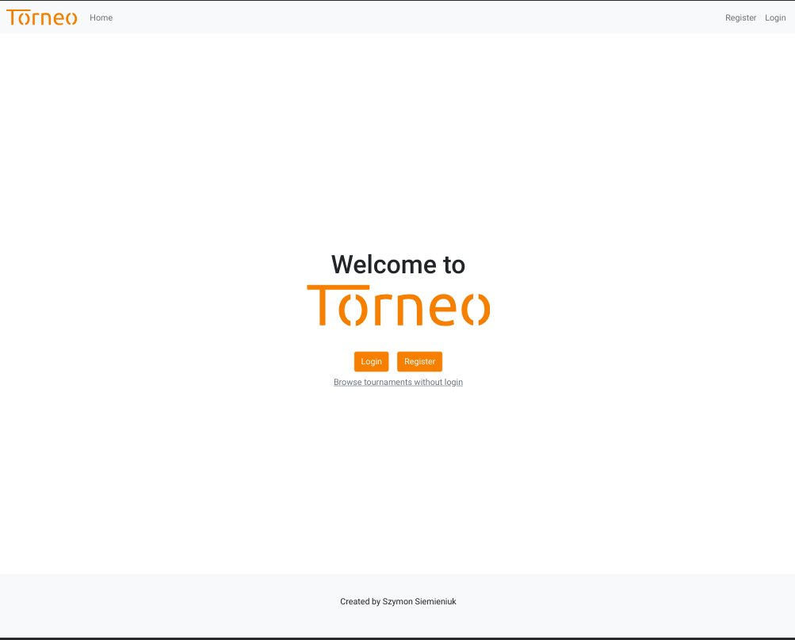
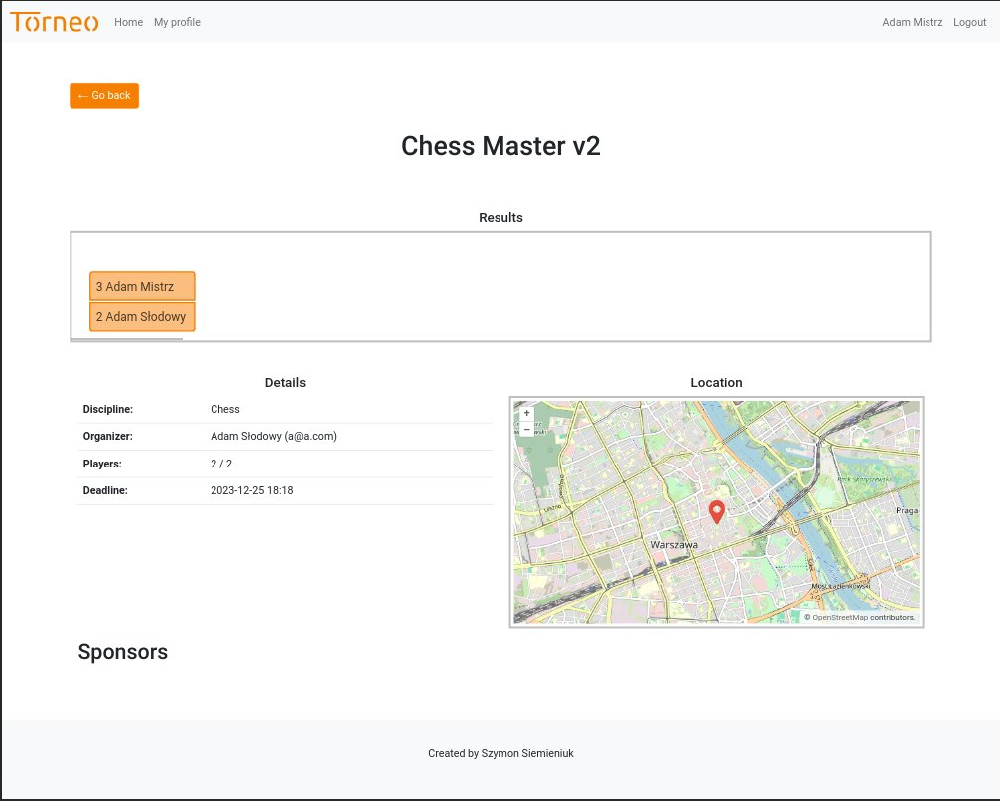
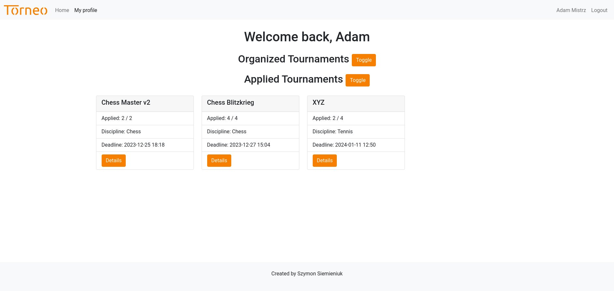

# Torneo
This project implements tournament system using Django MVC framework
and uses Bootstrap for styling. It has also integration with OpenStreetMap.

## Use cases
- CRUD operations on tournaments
- authentication with verification emails
- users can apply to any of the tournament
- each user can provide his own results from the tournament (if conflict, then
both results are withdrawn)
- users can browse tournaments
- each user can look at any tournament (even not registered); if started, then
additionally tournament results are fetched

## Technologies
- Docker
- Bootstrap 5
- Django 4.2
- Python 3.11

## Additional Scripts
- [JQueryBracket](https://github.com/teijo/jquery-bracket)

## Screenshots

## How To Run This

1. Make sure you have Docker installed.
2. Create a file .env and provide your custom environment variables.
3. Type command `docker-compose build`
4. Type command `docker-compose up`
5. Enjoy!
